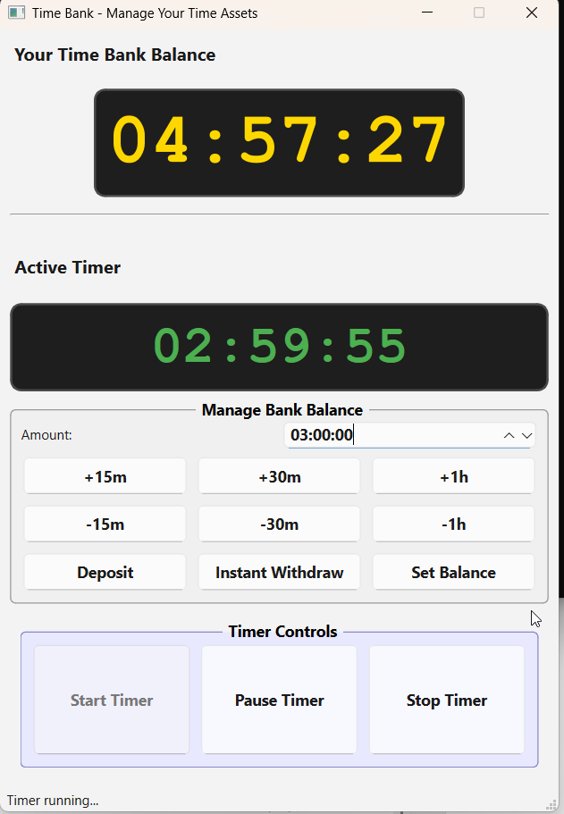

# Simple Timer Bank 🏦

Ever feel like you've *earned* some time to play video games 🎮, watch movies 🍿, or just relax, but have trouble tracking it?

**Simple Timer Bank** is your personal time bank for guilt-free leisure. Earn time by being productive, deposit it into your "bank," and then spend it whenever you want on the fun stuff.



## How It Works 🤔

-   **Earn & Bank Your Time**: Finished a task? Studied for an hour? Deposit that time into your bank. You've earned it!
-   **Start the Fun Timer**: Ready to play? Start a timer session to "withdraw" and spend your banked time.
-   **Go Into Overdraft**: Can't stop mid-game? No problem. The timer will go into "overdraft," borrowing from your main bank balance so you can finish your round. You'll get a notification, but the fun doesn't have to stop immediately.
-   **Stop Early, Get a Refund**: End your session early? The unused time is automatically refunded to your bank.

## Features

-   **Digital Clock Displays**: Clear, easy-to-read displays for both your bank balance and the active timer.
-   **Intuitive Transaction Controls**:
    -   Deposit, instantly withdraw, or set your bank balance to a specific value.
    -   Use relative preset buttons (`+15m`, `-30m`, etc.) to quickly adjust the transaction amount.
-   **Flexible Timer Controls**: Start, pause, resume, and stop timer sessions with clear, expanding buttons.
-   **Audio-Visual Alerts**: Receive non-blocking system notifications with custom sounds for key events like overdraft activation and bank depletion.
-   **Persistent State**: Your time bank balance is automatically saved when you close the application and reloaded on startup.
-   **Polished UI**: A clean, visually organized interface with distinct sections for different actions.

## Installation

The recommended way to install Simple Timer Bank is via `pip` or `uv`:

```bash
# Using pip
pip install simpletimerbank

# Or using uv
uv add simpletimerbank
```

## Usage

Once installed, you can run the application from your terminal:

```bash
simpletimerbank
```

## Development Setup

If you wish to contribute to the project, follow these steps to set up a development environment.

1.  **Clone the Repository**:
    ```bash
    git clone https://github.com/your-username/SimpleTimerBank.git
    cd SimpleTimerBank
    ```

2.  **Set up a Virtual Environment and Install**:
    This project uses `uv` for package management.
    ```bash
    # Create a virtual environment
    uv venv
    # Activate it (example for Windows PowerShell)
    .venv\Scripts\Activate.ps1
    # Install the project in editable mode with its dependencies
    uv pip install -e .
    ```

3.  **Run the Application from Source**:
    ```bash
    python -m src.simpletimerbank.main
    ```

## Development Tasks

-   **Run Tests**: `make test` or `uv run pytest`
-   **Build Documentation**: `make doc`
-   **Publish Documentation**: `make publish-docs`

## License

This project is licensed under the [MIT License](LICENSE).
